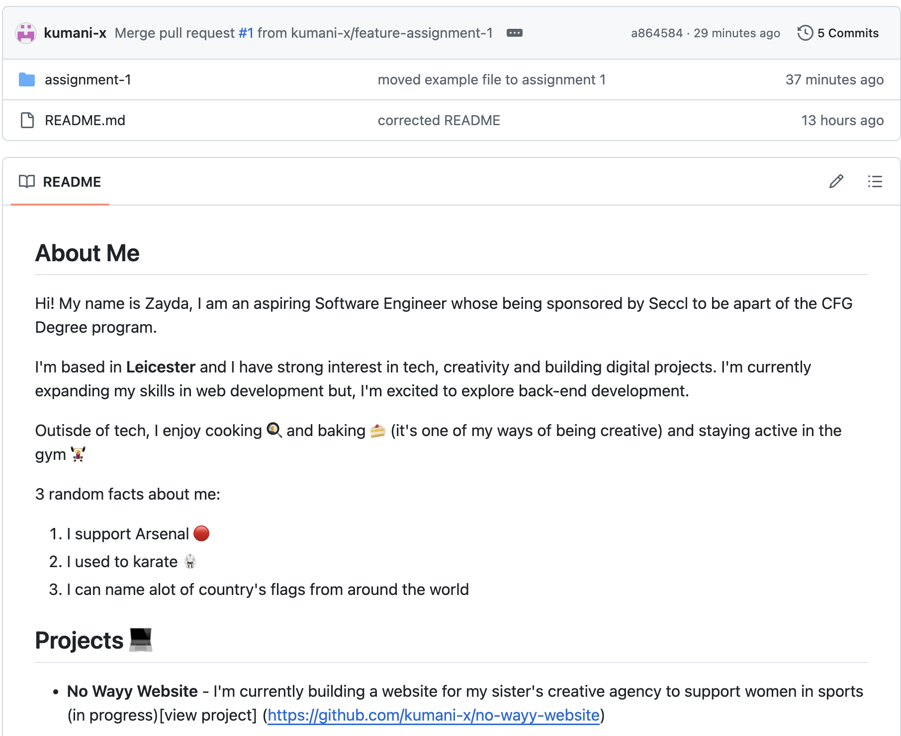
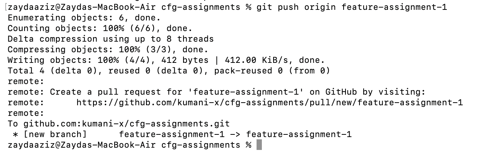
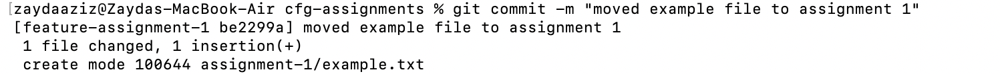
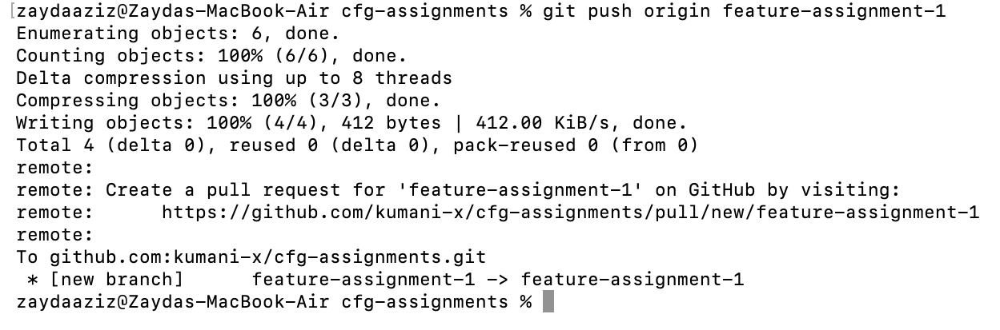
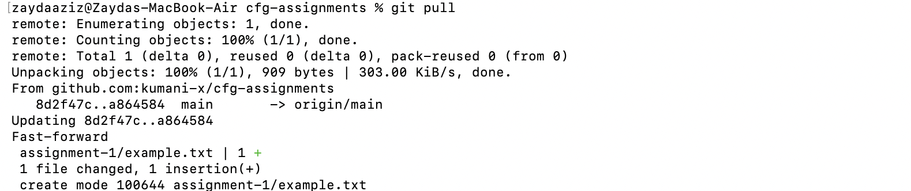
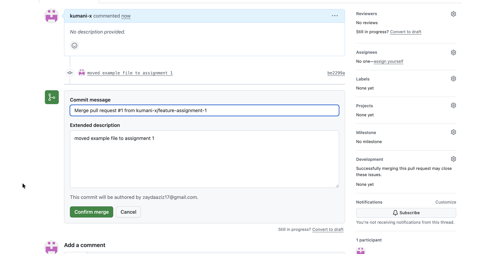
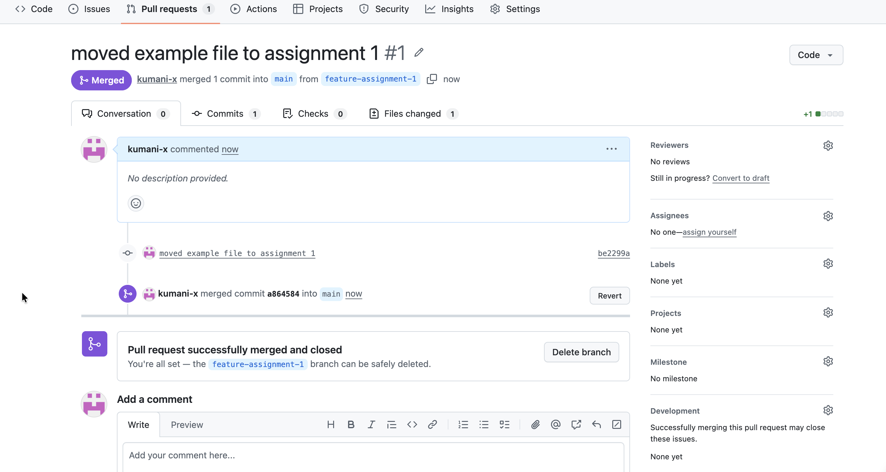

## About Me

Hi! My name is Zayda, I am an aspiring Software Engineer whose being sponsored by Seccl to be apart of the CFG Degree program.

I'm based in **Leicester** and I have strong interest in tech, creativity and building digital projects. I'm currently expanding my skills in web development but, I'm excited to explore back-end development.

Outisde of tech, I enjoy cooking :fried_egg: and baking :cake: (it's one of my ways of being creative) and staying active in the gym :weight_lifting_woman: 

3 random facts about me:
1. I support Arsenal (COYG!! :red_circle: :white_circle:)
2. I used to karate 🥋
3. I can name alot of country's flags from around the world :bangladesh: :jamaica: :montserrat:

## Projects :computer:

- **No Wayy Website** - I'm currently building a website for my sister's creative agency to support women in sports (in progress)[view project] (https://github.com/kumani-x/no-wayy-website)

- **Portfolio** - A portfolio to showcase my personal projects [view project] (https://github.com/kumani-x/Portfolio)


*Side note - this git repo will be used to upload my assignments and projects as well as, showcase my progression throughout the CFG Degree course.*


## Git Workflow

*To demonstrate my understanding of git workflow I will be showing how I set up my repositiory as well as demonstrating the following commands:*

- [X] Checking the status
- [X] Creating a branch
- [] Adding files to a branch
- [X] Adding commits with meaningful messages
- [] Opening a pull request
- [] Merging and deploying to main branch

## Getting started 

Here is a snippet of layout of my README file on code github:



To setup for this project:

1. I created a private repositiory on GitHub.
2. I copied the respositiory SSH URL.
3. I cloned the repository locally by:
    `git clone git@github.com:kumani-x/cfg-assignments.git`
4. To confirm the repo connected locally I added the command:
    `cd "cfg-assignments"` 

cd
: change directory is a command that allows you to move to the folder you want.

5. Then started my development on VS Code.

---

Normally, you can command `git init` in the terminal and then connect to GitHub using `git remote add origin` then `git push -u origin main` but I ran into some issues :sweat_smile:

### Creating a branch

To show my understanding of branching, I created a new branch from the main branch by commanding:

```bash
git checkout -b feature-assignment-1
```

---



### Creating and adding commits

After creating my new branch **(assignment-1)**, I add a file through then ran the commands:

```bash
git add assignment-1/example.txt
```
I used `assignment-1/example.txt` is so the example file specifically can be found within assignment-1.

After adding my file, I committed changes and added a meaningful message.

```bash
git commit -m
```

---



*Side note - Originally I did create the file first then the branch because I thought I created the branch but, it was added and committed within the feature branch at the same time to show the git workflow.*

### Push and pull requests

Once I committed to the changes, I pushed my assignment-1 branch to GitHub.

```bash
git push origin feature-branch
```

---



After pushing my branch to GitHub, I then opened a `git pull` request to compare my feature branch to the main.

Pull requests are ==important== as they give you the most up-to-date version remote repositiory e.g. GitHub, in our local repositiory.

Pull requests can also be used reviewing changes before updating, checking code quality, and collaborating with other developers.

---




### Merging and deploying to main branch

After reviewing the pull request, I finally merged my changes to the main branch on GitHub.

---



This merging process helps updates from the main branch to **main codebase** be streamlined and efficient.

---




